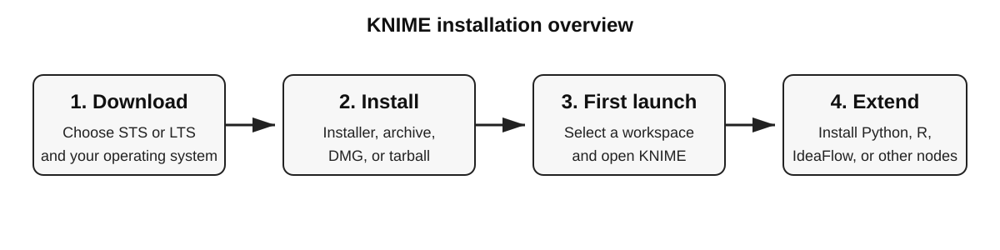
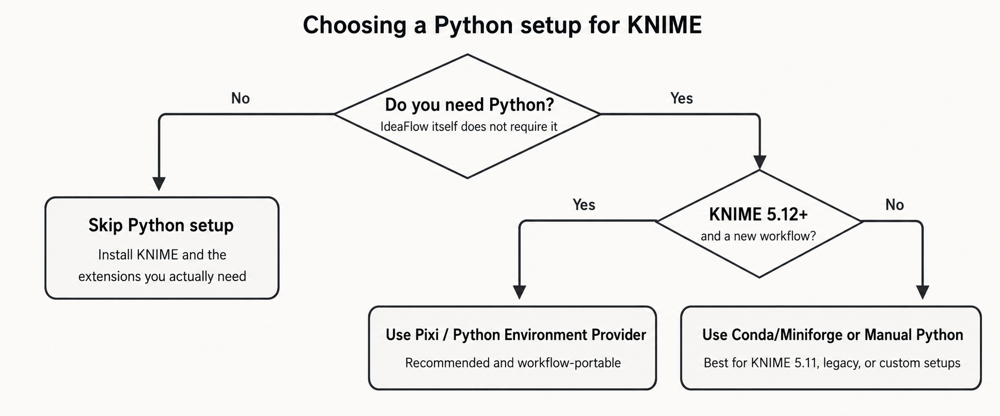

# Installing KNIME Analytics Platform

[Main README](../README.md) · [Documentation index](README.md) · [Overview](OVERVIEW.md) · [KNIME installation](KNIME_INSTALLATION.md) · [IdeaFlow installation](INSTALLATION.md) · [Node reference](NODES.md) · [Optimization problems](OPTIMIZATION_PROBLEMS.md) · [Workflow tutorial](WORKFLOW_TUTORIAL.md) · [Development](DEVELOPMENT.md) · [Troubleshooting](TROUBLESHOOTING.md)


This guide explains how to install KNIME Analytics Platform on Windows, macOS, and Linux, how to choose a workspace, how to install extensions, and how to configure Python with Pixi, Conda/Miniforge, or an existing `venv`/`pip` environment.

> [!IMPORTANT]
> KNIME Analytics Platform itself is **not installed with `pip` or Conda**.  
> Download and install the desktop application first. Pixi, Conda, `venv`, and `pip` are only used when a workflow needs Python.



## 1. Choose the installation that matches your needs

| Need | Recommended setup |
| --- | --- |
| Use standard KNIME nodes only | Install KNIME Analytics Platform; no Python setup is required |
| Use IdeaFlow | Install the KNIME version supported by the project; Python is not required |
| Run Python scripts in a new KNIME 5.12+ workflow | Install the Python Integration and use **Python Environment Provider (Pixi)** |
| Reuse an existing Conda environment or work with KNIME 5.11 | Use **Miniforge/Conda** |
| Reuse an existing `venv`, `pyenv`, or system Python | Use the **Manual Python** configuration |
| Run R scripts | Install the KNIME R Integration and configure an external R installation |

Official resources:

- [Download KNIME Analytics Platform](https://www.knime.com/downloads)
- [Official KNIME installation guide](https://docs.knime.com/ap/latest/analytics_platform_installation_guide/)
- [KNIME Analytics Platform user guide](https://docs.knime.com/ap/latest/analytics_platform_user_guide/)
- [Extensions and integrations](https://docs.knime.com/ap/latest/analytics_platform_extensions_and_integrations/)

## 2. Download KNIME Analytics Platform

Open the [official download page](https://www.knime.com/downloads).

KNIME offers two release lines:

- **Standard Release (STS):** receives new features more frequently and is appropriate for most users.
- **Long-Term Support (LTS):** changes less frequently and is intended for environments where stability is the priority.

For a shared project, use the version specified by that project instead of automatically selecting the newest release.

> [!NOTE]
> IdeaFlow is currently documented and tested with **KNIME Analytics Platform 5.11**. Check the project documentation before upgrading the KNIME version used for development or workflow export.

<!-- Image planned: KNIME download page showing the STS/LTS selector and operating-system downloads. -->
<!--  -->

## 3. Install KNIME on your operating system

### 3.1. Windows

The download page generally provides several formats:

- **Installer (`.exe`)** — easiest option; creates the installation and can add shortcuts.
- **Self-extracting archive (`.exe`)** — extracts KNIME into a folder.
- **ZIP archive (`.zip`)** — portable installation that can be extracted manually.

#### Installer method

1. Download the Windows installer.
2. Run the `.exe` file.
3. Select the installation directory.
4. Complete the installation.
5. Launch KNIME from the Start menu or desktop shortcut.

#### Portable ZIP method

1. Download the ZIP archive.
2. Extract it to a folder where you have write permission, for example:

```text
C:\Tools\KNIME\
```

3. Run:

```text
knime.exe
```

Avoid extracting KNIME into a temporary folder or a directory managed by cloud synchronization while it is running.

### 3.2. macOS

Choose the download matching the processor:

- **Apple Silicon:** M1, M2, M3, M4, or later Apple processors.
- **Intel:** older Intel-based Macs.

Installation:

1. Download the `.dmg` file.
2. Open it and wait for macOS verification.
3. Drag **KNIME** into **Applications**.
4. Open KNIME from the Applications folder.

Some third-party extensions may have different levels of support on Apple Silicon. Check the extension documentation when a node depends on native libraries.

### 3.3. Linux

1. Download the Linux tarball.
2. Extract it to a suitable location:

```bash
mkdir -p "$HOME/apps"
tar -xf knime_*.tar.gz -C "$HOME/apps"
```

3. Enter the extracted directory:

```bash
cd "$HOME/apps/knime_*"
```

4. Start KNIME:

```bash
./knime
```

Optional desktop launcher:

```ini
[Desktop Entry]
Type=Application
Name=KNIME Analytics Platform
Exec=/home/YOUR_USERNAME/apps/knime_VERSION/knime
Icon=/home/YOUR_USERNAME/apps/knime_VERSION/icon.xpm
Terminal=false
Categories=Development;Science;
```

Save it as:

```text
~/.local/share/applications/knime.desktop
```

Then make it executable:

```bash
chmod +x ~/.local/share/applications/knime.desktop
```

The exact extracted directory and icon filename may differ by release.

## 4. First launch and workspace selection

On first launch, KNIME asks for a **workspace**.

The workspace stores local workflows, node settings, and data generated by workflows. Use a dedicated folder rather than the KNIME installation directory.

Examples:

```text
Windows: C:\Users\<username>\KNIME-workspace
macOS:   /Users/<username>/KNIME-workspace
Linux:   /home/<username>/KNIME-workspace
```

Recommended rules:

- keep the workspace outside the KNIME installation folder;
- avoid temporary directories;
- avoid network drives for large local workflows unless required;
- do not commit the complete workspace to Git;
- commit exported workflows and project files instead.

<!-- Image planned: KNIME workspace selection dialog. -->
<!--  -->

After selecting the folder, click **Launch**.

## 5. Verify the installation

After KNIME opens:

1. Create a new workflow.
2. Search for a basic node such as **Table Creator**.
3. Drag it onto the canvas.
4. Configure and execute it.

To verify the installed version:

```text
Menu → About KNIME Analytics Platform
```

To update KNIME and installed extensions:

```text
Menu → Check for updates
```

For a research project, do not update the shared development environment without checking compatibility with the project and its exported workflows.

## 6. Install KNIME extensions

Extensions add nodes for Python, R, databases, deep learning, reporting, community integrations, and project-specific tools.

### 6.1. Install from KNIME

Open:

```text
Menu → Install Extensions
```

or, depending on the interface:

```text
File → Install KNIME Extensions...
```

Then:

1. search for the extension;
2. select it;
3. click **Next**;
4. accept the required licenses;
5. complete the installation;
6. restart KNIME.

### 6.2. Install from KNIME Community Hub

1. Open [KNIME Community Hub](https://hub.knime.com/).
2. Find the extension.
3. Drag its installation icon into KNIME.
4. Accept the installation prompt.
5. Restart KNIME.

### 6.3. Enable or add an update site

Open:

```text
Preferences → Install/Update → Available Software Sites
```

The **Community Extensions (Experimental)** update site is normally present but disabled by default. Enable it only when an extension explicitly requires it.

A local or zipped update site can also be added when the computer has restricted internet access.

Official guide:

- [Installing extensions and managing update sites](https://docs.knime.com/ap/latest/analytics_platform_installation_guide/#installing-extensions-and-integrations)

<!-- Image planned: KNIME Install Extensions window with the search field visible. -->
<!--  -->

## 7. Python support: choose the correct method



First install the extension:

```text
KNIME Python Integration
```

through **Install Extensions**, or follow the [KNIME Python Integration guide](https://docs.knime.com/ap/latest/python_installation_guide/).

> [!IMPORTANT]
> Do **not** run `pip install knime`. The unrelated PyPI package named `knime` can conflict with KNIME's scripting API.

### 7.1. Option A — Pixi and Python Environment Provider

**Recommended for new workflows on KNIME 5.12 or later.**

Pixi environments are defined inside the workflow and can be recreated on another compatible computer.

Prerequisites:

- KNIME Analytics Platform 5.12 or later;
- KNIME Python Integration;
- KNIME Conda Integration.

Steps:

1. Search for **Python Environment Provider**.
2. Add it to the workflow.
3. Open its configuration.
4. Add the required packages or edit the TOML/YAML specification.
5. Resolve the dependencies.
6. Connect the environment port to **Python Script** or **Python View**.

Example TOML:

```toml
[workspace]
channels = ["knime", "conda-forge"]
platforms = ["win-64", "linux-64", "osx-64", "osx-arm64"]

[dependencies]
python = "3.11.*"
knime-python-base = "*"
pandas = "*"
numpy = "*"
scikit-learn = "*"
matplotlib = "*"
```

Use `knime-python-scripting` instead of `knime-python-base` when the broader bundled scripting package set is required.

Official guide:

- [Set up Pixi for Python environment management](https://docs.knime.com/ap/latest/python_installation_guide/env-management/pixi-setup)

<!-- Image planned: Python Environment Provider configuration and its environment output connected to Python Script. -->
<!--  -->

### 7.2. Option B — Conda or Miniforge

This method is suitable for:

- KNIME 5.11;
- existing Conda workflows;
- users who maintain environments outside KNIME;
- projects requiring a shared `environment.yml`.

KNIME recommends [Miniforge](https://github.com/conda-forge/miniforge) as a Conda distribution.

#### Install Miniforge

Download the installer for the operating system from:

- [Miniforge releases](https://github.com/conda-forge/miniforge/releases)

After installation, open a new terminal and verify:

```bash
conda --version
```

#### Create an environment for KNIME

```bash
conda create -n knime-python \
  -c knime \
  -c conda-forge \
  knime-python-scripting \
  python=3.11 \
  pandas \
  numpy \
  scikit-learn \
  matplotlib \
  -y
```

Activate it:

```bash
conda activate knime-python
```

Add another Conda package later:

```bash
conda install -n knime-python -c conda-forge seaborn
```

Add a package available only through pip:

```bash
conda activate knime-python
python -m pip install package-name
```

Prefer Conda packages when both Conda and pip versions are available. Use pip after Conda has installed the base environment.

#### Connect Conda to KNIME

1. Open:

```text
Preferences → KNIME → Conda
```

2. Select the Miniforge/Conda installation directory.
3. Open:

```text
Preferences → KNIME → Python
```

4. Choose **Conda**.
5. Select `knime-python`.

Official guide:

- [Set up Conda or Miniforge](https://docs.knime.com/ap/latest/python_installation_guide/env-management/conda-setup)

#### Reproducible `environment.yml`

Create:

```yaml
name: knime-python
channels:
  - knime
  - conda-forge
dependencies:
  - python=3.11
  - knime-python-scripting
  - pandas
  - numpy
  - scikit-learn
  - matplotlib
```

Then build it with:

```bash
conda env create -f environment.yml
```

Update an existing environment:

```bash
conda env update -f environment.yml --prune
```

Export a concise environment history:

```bash
conda env export -n knime-python --from-history > environment.yml
```

### 7.3. Option C — Existing Python, `venv`, or pip environment

Use this option when the machine already has a controlled Python installation and Conda/Pixi is not desired.

Create a virtual environment.

#### Windows PowerShell

```powershell
py -3.11 -m venv .venv
.\.venv\Scripts\Activate.ps1
python -m pip install --upgrade pip
python -m pip install pandas numpy pyarrow scikit-learn matplotlib
```

#### Linux or macOS

```bash
python3.11 -m venv .venv
source .venv/bin/activate
python -m pip install --upgrade pip
python -m pip install pandas numpy pyarrow scikit-learn matplotlib
```

Then configure KNIME:

```text
Preferences → KNIME → Python → Manual
```

Point KNIME to the environment's Python executable:

```text
Windows: <project>\.venv\Scripts\python.exe
Linux/macOS: <project>/.venv/bin/python
```

A start script can be used when activation or environment variables are required.

Official guide:

- [Manual Python executable or start script](https://docs.knime.com/ap/latest/python_installation_guide/env-management/manual-setup)

> [!WARNING]
> A plain pip/venv setup is the most manual option. Package compatibility must be maintained by the user. For portable shared workflows, prefer Pixi or a versioned Conda environment.

### 7.4. Test Python inside KNIME

Add a **Python Script** node and run:

```python
import sys
import pandas as pd
import numpy as np

print(sys.version)
print("pandas:", pd.__version__)
print("numpy:", np.__version__)
```

For KNIME table input/output, use the template generated by the Python Script node and the official scripting API documentation rather than assuming that a standalone Python script will run unchanged.

Useful links:

- [KNIME Python Integration guide](https://docs.knime.com/ap/latest/python_installation_guide/)
- [Bundled Python packages](https://docs.knime.com/ap/latest/python_installation_guide/reference/bundled-packages)
- [Python integration troubleshooting](https://docs.knime.com/ap/latest/python_installation_guide/reference/troubleshooting)

## 8. Optional R integration

R is not required for KNIME or IdeaFlow.

To use R nodes:

1. install **KNIME Interactive R Statistics Integration**;
2. install R from [The Comprehensive R Archive Network](https://cran.r-project.org/);
3. install the packages required by the KNIME integration;
4. configure the R home path in:

```text
Preferences → KNIME → R
```

Official guide:

- [KNIME R Installation Guide](https://docs.knime.com/ap/latest/r_installation_guide/)

## 9. Memory configuration

KNIME memory settings are stored in `knime.ini`, located in the KNIME installation directory.

Example:

```text
-Xmx8192m
```

This allows KNIME to use up to approximately 8 GB of heap memory.

A common starting point is around half of the computer's available RAM, while leaving enough memory for the operating system and external tools. Do not allocate all physical memory to KNIME.

On macOS, `knime.ini` is inside the application bundle:

```text
KNIME.app/Contents/Eclipse/knime.ini
```

Restart KNIME after changing this file.

Official reference:

- [KNIME configuration and memory settings](https://docs.knime.com/ap/latest/analytics_platform_installation_guide/#configuration-settings-and-knime-ini-file)

## 10. Install IdeaFlow after KNIME

IdeaFlow is a Java KNIME extension and does not require Python, pip, Conda, or R.

After installing the KNIME version supported by the project, follow the IdeaFlow installation section in the repository:

- [IdeaFlow installation instructions](INSTALLATION.md)

For a development build, the extension may be installed from a local update site or as a development JAR according to the project instructions.

## 11. Troubleshooting

### KNIME does not start

- Verify that the archive was fully extracted.
- Move the installation to a directory where the user has read/write permission.
- Check `knime.log` and the workspace metadata logs.
- Restore recent changes to `knime.ini` if the issue started after editing memory settings.
- On Linux, launch KNIME from a terminal to see missing-library messages.

### An extension is not visible

- Restart KNIME after installation.
- Check enabled update sites.
- Verify that the extension supports the installed KNIME version.
- Remove duplicate development JARs from `dropins`.
- Search for an exact node name rather than only the extension name.

### Python cannot start

- Open the [official Python troubleshooting guide](https://docs.knime.com/ap/latest/python_installation_guide/reference/troubleshooting).
- Verify the executable selected in Preferences.
- Run the same Python executable from a terminal.
- Confirm that the environment contains the required packages.
- Remove the conflicting PyPI package with:

```bash
python -m pip uninstall knime
```

- Recreate the environment when binary packages were installed for the wrong operating system or processor architecture.

### Conda environment is not listed

- Verify the Conda path under `Preferences → KNIME → Conda`.
- Restart KNIME after installing Miniforge.
- Run `conda env list` in a terminal.
- Ensure that the environment was created by the same Conda installation selected in KNIME.

### A workflow works on one computer only

Check for:

- absolute file paths;
- unshared local datasets;
- unversioned Python packages;
- missing extensions;
- different KNIME versions;
- operating-system-specific native libraries;
- environment variables or credentials stored outside the workflow.


## 13. Official references

- [KNIME Analytics Platform downloads](https://www.knime.com/downloads)
- [Install and configure KNIME](https://docs.knime.com/ap/latest/analytics_platform_installation_guide/)
- [KNIME Analytics Platform user guide](https://docs.knime.com/ap/latest/analytics_platform_user_guide/)
- [Extensions and integrations](https://docs.knime.com/ap/latest/analytics_platform_extensions_and_integrations/)
- [KNIME Python Integration](https://docs.knime.com/ap/latest/python_installation_guide/)
- [Pixi environment management](https://docs.knime.com/ap/latest/python_installation_guide/env-management/pixi-setup)
- [Conda and Miniforge setup](https://docs.knime.com/ap/latest/python_installation_guide/env-management/conda-setup)
- [Manual Python setup](https://docs.knime.com/ap/latest/python_installation_guide/env-management/manual-setup)
- [Python troubleshooting](https://docs.knime.com/ap/latest/python_installation_guide/reference/troubleshooting)
- [KNIME R integration](https://docs.knime.com/ap/latest/r_installation_guide/)
- [KNIME Community Hub](https://hub.knime.com/)

---

## Related documentation

- [Install IdeaFlow](INSTALLATION.md)
- [KNIME official downloads](https://www.knime.com/downloads)
- [KNIME documentation](https://docs.knime.com/)
- [Node reference](NODES.md)
- [Troubleshooting](TROUBLESHOOTING.md)
